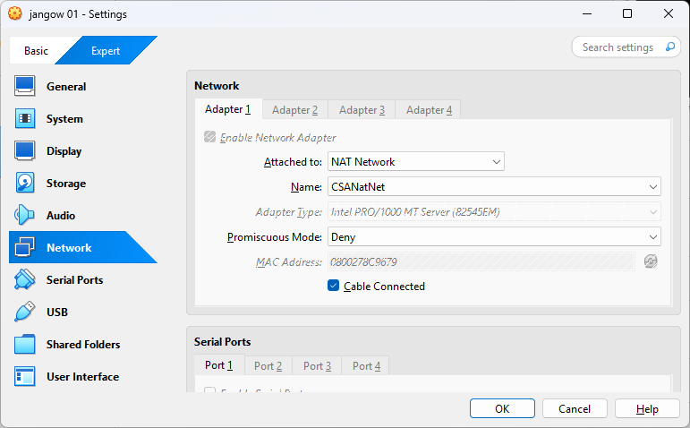
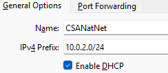
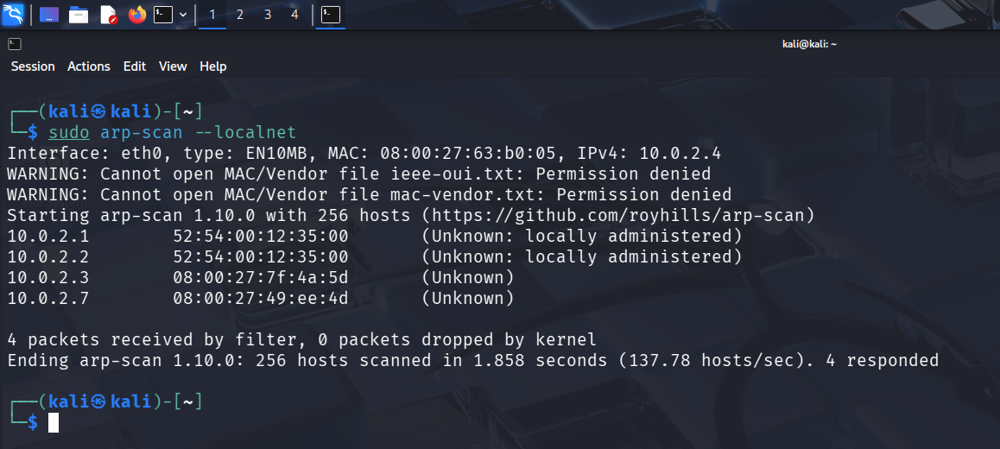
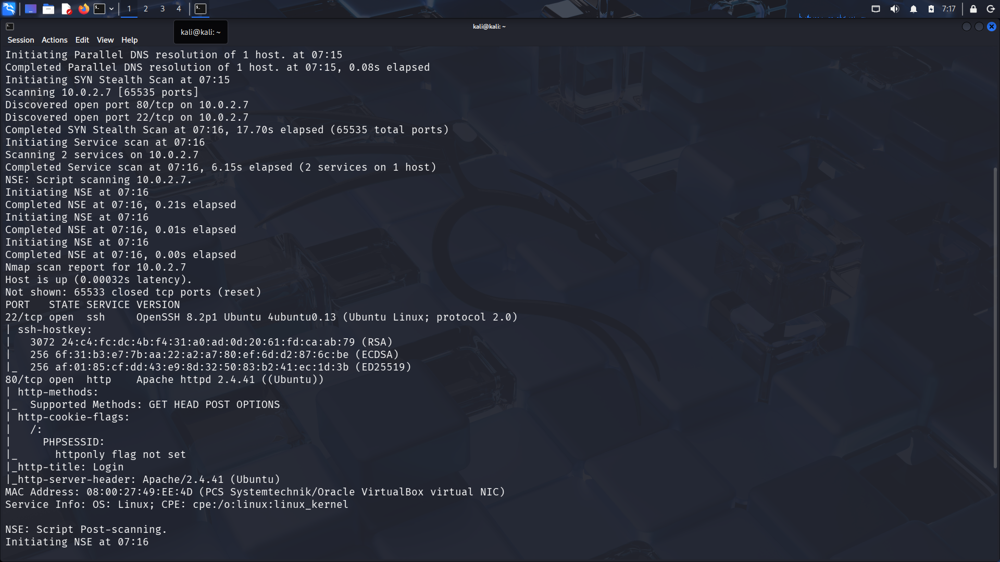
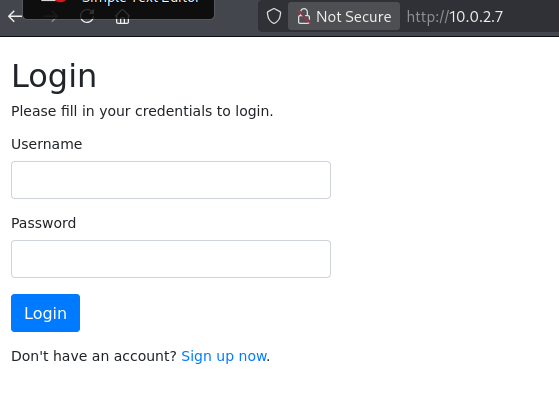

Проходження napping

### Мережевий аналіз

- Опісля запуску віртуальної машини потрібно визначити IP-адресу цільової машини  
- Звичайно, що IP-адреса у кожному випадку може відрізнятися. Для поточного документу було використану наступну мережеву конфігурацію
  Oracle Virtual Box  
    
  Мережевий адаптер №1 під’єднаний до NAT Мережі CSANatNet, яка має
  наступні налаштування:  
  

- Для визначення IP-адреси цільової машини можна використати наступні утиліти **arp-scan** або **nmap**

```bash
sudo arp-scan --localnet
````
Результат  


- сміло можна вважати, що IP-адреса цільової машини є **10.0.2.7** згідно визначеної мережевої конфігурації.
- За допомогою **nmap** визначимо набір відкритих мережевих портів

```bash
sudo nmap -v -sV -sC -p- 10.0.2.7
````
Результат  


- За результатами роботи **nmap** бачимо відкриті порти 22 і 80

### Дослідження вебсторінки

- Відкриваємо переглядало (браузер) **http://10.0.2.7**

